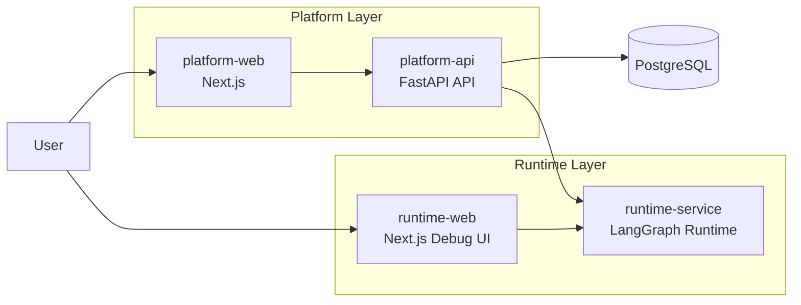

# Agent Platform

Agent Platform 是一个围绕 **LangGraph** 构建的通用 AI 智能体平台工作区。

它采用 **平台控制面 + 运行时执行面** 的双层架构，既可以承载 AI 测试平台这样的具体业务场景，也可以扩展到更多基于 LangGraph 的智能体系统开发。

## 项目初心

这是一个用 AI 协同开发通用智能体平台的长期实践项目。

在此之前，我已经完成过两套测试平台的开发；这一次我想做一个更有挑战的版本：在自己主导架构与关键设计的前提下，让 AI 深度参与一个可扩展、可二开的 LangGraph 智能体平台的实现、重构与演进。

它不只是一个具体业务平台仓库，也是一场关于「如何把 AI 真正带进工程开发流程」的持续实验。如果这个项目对你有帮助，欢迎 star，也欢迎交流讨论。

如果你想直接了解这个项目为什么会这样设计、经历了哪些阶段演进，可以直接看：[项目故事与演进记录](docs/project-story.md)

它当前由四个可以独立运行的应用组成：

- `apps/platform-api`：平台后端 / 控制面 API
- `apps/platform-web`：平台主前端 / 产品入口
- `apps/runtime-service`：LangGraph 执行层 / 图运行时
- `apps/runtime-web`：直连 runtime 的调试前端

当前阶段的目标是：

- 完成仓库重组
- 保持四个应用独立运行
- 保持平台与 runtime 能正常联调
- 暂不做依赖融合与大规模代码重构

## 系统布局



这张图对应当前仓库里的两条主链路：

- **平台链路**：`platform-web -> platform-api -> runtime-service`
- **调试链路**：`runtime-web -> runtime-service`

## 为什么拆成四个应用

这样拆的目的不是把系统切碎，而是把职责边界拉清楚：

- `platform-*` 负责治理、管理、鉴权、目录与配置能力
- `runtime-*` 负责图执行、模型能力、工具能力与独立调试

这让仓库可以同时满足两件事：

- 作为一个完整系统统一维护
- 每个应用仍然可以独立启动、独立验证、独立演进

## 仓库结构

```text
agent-platform/
├── apps/
│   ├── platform-api/
│   ├── platform-web/
│   ├── runtime-service/
│   └── runtime-web/
├── docs/
├── scripts/
└── archive/
```

- `apps/`：四个独立应用
- `docs/`：根级公共文档
- `scripts/`：统一启动/停止/健康检查脚本
- `archive/`：归档说明与历史入口

更详细的结构说明见 `docs/repo-layout.md`。

## 四个应用分别是什么

### `apps/platform-api`

- 平台控制面后端
- 提供：
  - `/_management/*`
  - `/api/langgraph/*`
  - 平台数据库能力
  - 鉴权、审计、catalog、assistant 管理

### `apps/platform-web`

- 平台主前端
- 面向：
  - 管理台
  - 平台侧聊天入口
  - assistant / graphs / runtime catalog 页面

### `apps/runtime-service`

- LangGraph 执行层
- 核心内容在 `graph_src_v2`
- 负责：
  - 图执行
  - 模型装配
  - 工具 / MCP 装配
  - runtime 自定义能力路由

### `apps/runtime-web`

- 直连 runtime 的调试前端
- 用于独立验证 LangGraph server 本身
- 不经过平台 API

## 快速开始

推荐启动顺序：

1. `runtime-service`
2. `platform-api`
3. `platform-web`
4. `runtime-web`（按需）

根目录快捷脚本：

```bash
scripts/dev-up.sh
scripts/check-health.sh
scripts/dev-down.sh
```

更详细的本地联调说明见：

- `docs/local-dev.md`
- `docs/startup-verification-guide.md`

## 当前状态

当前仓库已经完成：

- 四个应用迁入 `apps/*`
- 旧版根目录代码从当前工作分支移除
- `runtime-service` 可启动
- `platform-api` 可启动
- `platform-api -> runtime-service` 联调通过
- `platform-web` / `runtime-web` 已去除 Google Fonts 构建时外网依赖

当前仍保持的约定：

- 每个应用独立维护自己的环境与依赖
- 根目录暂不统一 Python/Node 依赖
- 根目录 `.pre-commit-config.yaml` 当前临时禁用，后续再统一启用

迁移细节见：

- `docs/migration-notes.md`
- `docs/planning/apps-split-migration-plan.md`

## 文档导航

- `docs/repo-layout.md`：仓库整体结构与职责边界
- `docs/local-dev.md`：本地开发与联调说明
- `docs/env-matrix.md`：四个应用的环境变量矩阵
- `docs/deployment-guide.md`：拉取代码后的环境准备、PostgreSQL、uv/pnpm 与四应用部署说明
- `docs/migration-notes.md`：迁移状态与当前验证结论
- `docs/startup-verification-guide.md`：当前可执行启动与数据库检查说明
- `docs/frontend-capability-plan.md`：前端能力对照与后续接入规划
- [docs/project-story.md](docs/project-story.md)：项目初心、开发日志与演进记录

## AI 助手文档

这一组文档不是单纯给人阅读的说明书，而是给 AI 助手、开发者代理或自动化协作流程使用的操作指令。后续如果继续增加新的 AI 助手说明，也统一放在这里，方便用户和开发者快速找到与项目配套的 AI 能力入口。

- `docs/ai-deployment-assistant-instruction.md`：给 AI 助手使用的问答式部署引导指令

## 支持与交流

如果这个项目对你有帮助，欢迎给一个 star。

如果你希望交流测试平台、AI 协同开发、LangGraph / MCP 相关实践，可以查看：

- [docs/project-story.md](docs/project-story.md)

个人微信号：


## 旧代码与历史说明

旧版 `AITestLab` 代码已不再保留在当前工作分支目录中。

如需回看旧版代码，请切换到远端备份分支：

- `origin/backup/main-before-apps-split-20260309`
