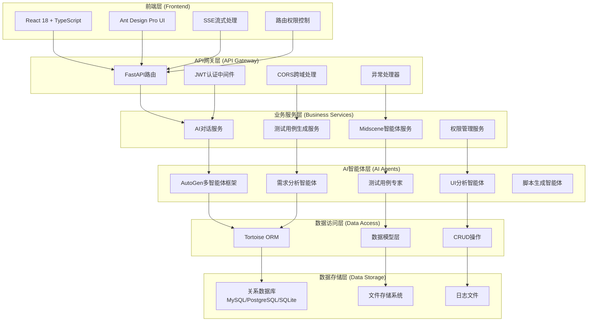
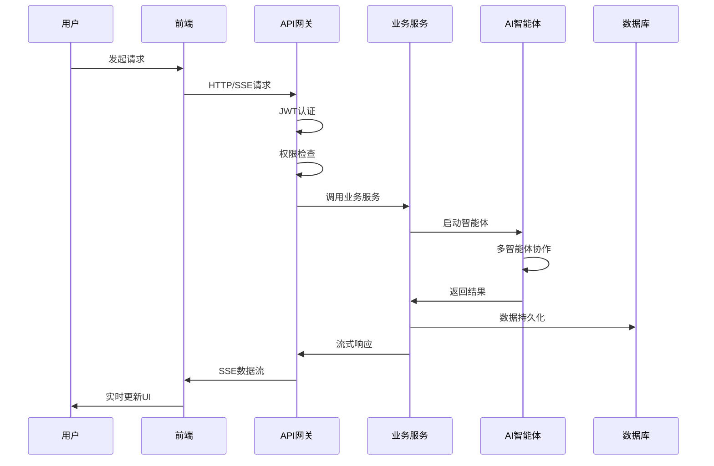
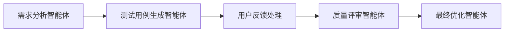
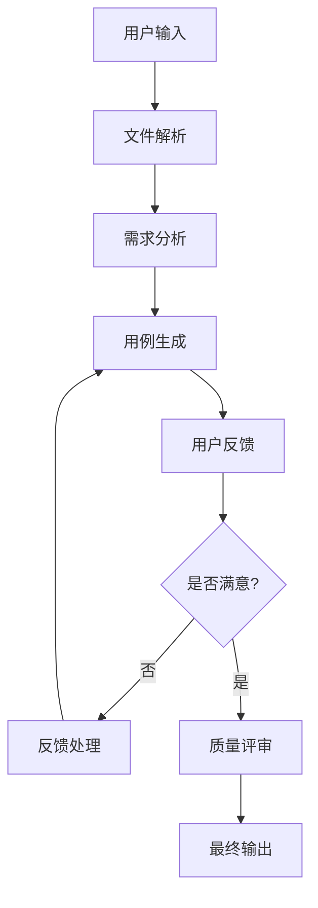

# 和AI一起开发测试开发平台

已经完成两个测试平台的开发项目了,基本上完全手写,这次我想做一个挑战,使用AI帮我完成测试平台开发的项目,我会将所有的步骤记录到这个文档中,如果你感兴趣,欢迎加我微信和我交流讨论😄

⭐ 如果这个项目对您有帮助，请给我一个星标！😄

---

~~如下项目中涉及调用deepseek的接口,已经被本人禁止掉,请谅解,体验地址中只能看到一个前端demo,大部分功能不可用~~

~~原因:近期发现一些异常的token消耗,怀疑有人恶意调用导致~~

~~我公开代码只是想和大家做个朋友,做技术交流使用,也从未有过任何盈利的行为,因此,不希望被一些恶意用户骚扰,谢谢~~

后续更新,我会将项目的效果进行截图展示,大家可以自己部署到本地体验,如果有问题,欢迎加我微信和我交流

[自动化测试平台](https://www.coder-ljx.cn:7524/user/login)

[AI测试平台](https://www.coder-ljx.cn:3100/login)

账号密码:test

个人微信号:


---
## 日记及后续安排

想收集一些大家的想法，你们希望一个测试类型的平台应该包含哪些功能，有哪些模块，对我来说，当时的初衷是想用vibe coding+AI做一个很小很小的demo平台，一来是把这些年学到的内容做一个输出和展示，二来也是想着，搭好一个通用的架子，任何人都可以拿来二开放到自己业务中，有一款自己的开源项目是我的一个执念吧，我也一直秉持的是开源和分享的原则，这样自己成长才会更快

做着做着又感觉技术在不断的革新，这过程有了好多新的想法，又学了很多新的东西，原本的框架又要推倒重来（改原来的代码就好比堆屎山☺），当前项目感觉像是在传授经验了

未来我要整理整理思路，把框架做通用，做简单，做易懂

（近来年底，事情又不少，还要忙一段工作，抽时间把规划做好，也希望得到测试道友们意见和反馈☺）

时间：2026年01月06日


https://github.com/ljxpython/langgraph_teach 项目中，会包含所有我个人学习 langgraph 和 langchain 的学习代码，涉及 智能体，graph 构建，多模态，ReAct，上下文工程等等 AI 相关知识，感兴趣的朋友可以拉取下来一起学习，后面会基于里面的相关代码进行扩展，完成本测试平台的开发，大体还需要 2 个月的时间准备，之后我会重构本项目，用更加简洁的代码完成更加负责的事情，重构的项目会涉及用例生成，接口，性能，UI（看情况）等等一些模块

时间：2025 年 11 月 28 日

在`langgraph_teach`文件夹中,我增加了很多langgraph&langgraph的学习代码,大家可以参考,也可以直接运行,查看效果,后续的平台开发将Autogen转变为langgraph&langchain

时间: 2025年11月11日

后续会使用langgraph框架来更新这个项目,想想当初随性而写的一个项目,零零散散到了现在,不会放弃,会慢慢更新,做成一个真正的可以简单二开就能在企业使用的智能化测试平台,在AI开发的过程中,本人也有了很多新的感悟,后续会慢慢添加到该项目中的

时间: 2025年11月07日

工作上的事情算是告一段落, terminal agent + MCP在软件测试赋能已经开始落地,效果不错,后面开始修复一些bug,在增加新的功能即可,效果大家可以看:https://www.yuque.com/lijiaxin-woaqo/gs9ge5/vriqtnc7lmly94ae?singleDoc# 《Terminal Agents + MCP AI测试代码生成项目搭建及效果展示》

后续,我将会继续完善这个项目,当前项目应该也会做重大的更新,框架由之前的Autogen 切换为langgraph,这段时间也对这个框架做了一些二开和研究,发现使用上比较顺手

时间: 2025年11月03日

最近开始着手实践 terminal agent + MCP在软件测试赋能上的使用,(ps:忙完了Trae + MCP的实践探索) Trae+MCP的部分一直没时间整理就进入了下一个阶段的探索

有时间一定给大家补上,也直接加我微信一起交流哈,也就国庆有时间抽空写一写github了

时间: 2025年10月4号

近期工作比较忙,工作上一直在探索Trae + MCP 赋能接口自动化测试生成的事情,可能拿出来开发本项目的时间较少,欢迎大家直接加我微信交流,再次希望大家给个星标哈😄

MCP + AI agent 在各个领域的应用,我认为也是未来一个大方向,如果项目落地可行后,我也会更新这方面的知识😄

时间: 2025年08月05日

后面也会做一些项目的重构工作,做代码精简,增加代码注释及说明,让代码看着更加可解读且不冗余

时间: 2025年08月17日

## 技术栈

AI技术栈:

```
autogen0.5.7
llamaindex
pydanticai
langchain
```


后端技术栈:

```
Python
fastapi
Tortoise
Aerich
```


前端技术栈:

```
react
ant.designPro
TS
```


代码规范:

```
组件名: 大驼峰命名 (PascalCase)
文件名: 短横线命名 (kebab-case)
变量名: 小驼峰命名 (camelCase)
常量名: 大写下划线 (UPPER_SNAKE_CASE)
后端:使用Black和Isort进行代码格式化
前端:使用Ruff进行代码检查
```

项目部署:

```
git
Nginx
```


## 前提

这并不是一个小白项目,如果完全没有项目经验,跟我一起实践的过程可能会遇到很多困难,希望你在掌握一定的基础后再来跟我操作

相关基础在我的博客中也有提及,也欢迎翻阅😁

[个人博客](https://www.coder-ljx.cn:8825/)

在看我搭建完成测试框架的整个过程,我想你也能明白,AI只是帮我们提高了编码效率,前后端及部署相关的知识,如果你不懂,其实是根本没办法让AI来代替你编码的,这也是我一直践行的一个道理:打铁还需自身硬!

PS: 有很多人加我微信问我,这个项目是完全由AI完成的吗,我想告诉你,大部分的代码是的,我告诉AI助手我的设计思路且给出核心的代码,让其在这个基础上进行封装,不过请你一定不要把这个过程想象的这么简单:

1. 首先你要知道用什么技术栈,相关知识的核心需要掌握,如果你根本都不懂,或者没有接触过,没有自己独立部署敲过一遍项目,那么你可能会很痛苦,因为你根本不知道要怎么让AI解决
2. AI可能给出一个错误的思路和方案,你根本都没有意识到,可以看下我docs/work文档下和AI的对话,不是AI生成完代码就可以了,我需要通读一遍他写的代码,确认主要逻辑没有问题,如果有问题,需要他进行修改
3. 框架性思维,这点其实很重要,因为AI设计出的代码有时候很流水账,其实很多功能是可以复用且各个模块应该解耦出来的,如果你没有,在这个过程中,请你好好思考,如何抽象,封装,系统,如果你能做到我说,那么对你来说将受益颇深


## 说明

这个项目的进度可能需要根据作者的业余时间而定,做不定期更新,技术交流请直接加微信


## AI工具使用

在编写代码的过程中,本次笔者会尽可能的前端使用AI生成,后端大部分手写,小部分使用AI

工具上我们可以使用的有`cursor` `Augment` `Trae` 均可,注意其中有些软件后期是需要付费的,选取一款你认为好用的即可,这里不做过多的评判


## 架构

### 🏗️ 技术架构概览

本项目采用现代化的前后端分离架构，基于AI驱动的测试平台设计，支持多智能体协作和企业级权限管理。

#### 🔧 技术栈总览

**后端技术栈**:
- **FastAPI + Tortoise ORM**: 高性能异步Web框架 + 异步数据库ORM
- **AutoGen 0.5.7**: Microsoft多智能体对话框架
- **多数据库支持 + Aerich**: 支持MySQL/PostgreSQL/SQLite等 + 迁移管理工具
- **JWT + RBAC**: 无状态认证 + 基于角色的权限控制
- **Poetry + Loguru**: 依赖管理 + 现代化日志系统

**前端技术栈**:
- **React 18 + TypeScript**: 现代化前端框架 + 类型安全
- **Ant Design Pro**: 企业级UI组件库
- **Vite + SWR**: 快速构建工具 + 数据获取库
- **React Router + SSE**: 路由管理 + 流式数据处理

#### 🏛️ 架构设计模式

**后端架构模式**:
- **工厂模式**: 统一的应用创建和初始化流程
- **分层架构**: API → 控制器 → 服务 → 模型的清晰分层
- **依赖注入**: 基于FastAPI的权限依赖注入系统
- **智能体模式**: AutoGen多智能体协作框架

**前端架构模式**:
- **组件化架构**: 页面 → 布局 → 业务 → 通用组件分层
- **状态管理**: 本地状态 + 全局Context + 服务端状态
- **路由保护**: 基于认证状态的路由访问控制
- **流式处理**: SSE实时数据流处理机制

#### 📊 系统架构图



#### 🔄 数据流架构



### 📁 项目结构

```
AITestLab/
├── main.py                    # 应用启动入口
├── backend/                   # 后端服务
│   ├── __init__.py           # 工厂模式应用创建
│   ├── api/v1/               # API路由层
│   │   ├── auth.py           # 认证API
│   │   ├── chat.py           # AI对话API
│   │   ├── testcase.py       # 测试用例生成API
│   │   ├── midscene.py       # Midscene智能体API
│   │   └── system.py         # 系统管理API
│   ├── controllers/          # 控制器层
│   ├── services/             # 业务服务层（按功能模块组织）
│   │   ├── ai_chat/          # AI对话模块
│   │   │   └── autogen_service.py    # AutoGen智能体服务
│   │   ├── testcase/         # 测试用例生成模块
│   │   │   └── testcase_service.py   # 测试用例生成服务
│   │   ├── ui_testing/       # UI测试模块
│   │   │   └── midscene_service.py   # Midscene智能体服务
│   │   ├── document/         # 文档处理模块
│   │   │   ├── document_service.py   # 文档处理服务
│   │   │   ├── file_processor.py     # 文件处理器
│   │   │   └── image_analyzer.py     # 图像分析器
│   │   └── auth/             # 认证权限模块
│   │       ├── auth_service.py       # 认证服务
│   │       └── permission_service.py # 权限管理服务
│   ├── models/               # 数据模型层
│   │   ├── user.py           # 用户模型
│   │   ├── chat.py           # 对话模型
│   │   ├── testcase.py       # 测试用例模型
│   │   └── role.py           # 角色权限模型
│   ├── ai_core/              # AI核心框架（基于AutoGen 0.5.7）
│   │   ├── __init__.py       # 统一导出接口
│   │   ├── llm.py           # LLM客户端管理器（支持多模型）
│   │   ├── factory.py       # 智能体工厂
│   │   ├── runtime.py       # 运行时管理器
│   │   ├── memory.py        # 内存管理器
│   │   ├── message_queue.py  # 消息队列管理
│   │   └── docs/            # 完整开发文档
│   │       ├── README.md                           # 文档中心
│   │       ├── AI_CORE_DEVELOPMENT_GUIDE.md       # 开发指南
│   │       ├── TESTCASE_SERVICE_EXAMPLE.md        # 实现案例
│   │       ├── SSE_AND_FEEDBACK_GUIDE.md          # SSE与反馈指南
│   │       ├── AUTOGEN_RUNTIME_GUIDE.md           # 运行时指南
│   │       └── FRAMEWORK_INTEGRATION_GUIDE.md     # 集成指南
│   ├── rag_core/             # RAG知识库系统
│   │   ├── __init__.py       # 模块初始化
│   │   ├── rag_system.py     # RAG系统主类
│   │   ├── vector_store.py   # 向量数据库接口
│   │   ├── query_engine.py   # 查询引擎
│   │   ├── embedding_generator.py # 嵌入向量生成
│   │   ├── llm_service.py    # LLM服务
│   │   ├── collection_manager.py # Collection管理
│   │   ├── data_loader.py    # 数据加载器
│   │   └── docs/            # RAG开发文档
│   │       ├── README.md                    # RAG系统概述
│   │       ├── architecture.md             # 系统架构设计
│   │       ├── development_guide.md        # 开发规范
│   │       ├── api_reference.md            # API参考文档
│   │       ├── configuration.md            # 配置管理
│   │       ├── troubleshooting.md          # 故障排除
│   │       └── examples/                   # 示例代码
│   ├── api_core/             # API核心工具层
│   │   ├── __init__.py       # 模块初始化
│   │   ├── crud.py           # CRUD基类
│   │   ├── response.py       # 响应处理
│   │   ├── exceptions.py     # 异常定义
│   │   ├── deps.py           # 依赖注入
│   │   ├── security.py       # 安全认证
│   │   └── database.py       # 数据库配置
│   ├── docs/                 # 后端开发文档
│   │   ├── README.md         # 文档导航
│   │   ├── api/              # API开发相关
│   │   ├── development/      # 开发规范相关
│   │   ├── database/         # 数据库相关
│   │   ├── core/             # 核心架构
│   │   └── examples/         # 示例代码
│   ├── conf/                 # 配置管理
│   └── utils/                # 工具函数
├── frontend/                  # 前端应用
│   ├── src/
│   │   ├── App.tsx           # 根组件
│   │   ├── main.tsx          # 应用入口
│   │   ├── pages/            # 页面组件
│   │   │   ├── HomePage.tsx      # 首页
│   │   │   ├── ChatPage.tsx      # AI对话页面
│   │   │   ├── TestCasePage.tsx  # 测试用例生成页面
│   │   │   ├── MidscenePage.tsx  # Midscene智能体页面
│   │   │   └── system/           # 系统管理页面
│   │   ├── components/       # 通用组件
│   │   │   ├── SideNavigation.tsx    # 侧边导航
│   │   │   ├── ChatMessage.tsx       # 聊天消息组件
│   │   │   ├── StreamingContent.tsx  # 流式内容组件
│   │   │   └── FileUpload.tsx        # 文件上传组件
│   │   ├── services/         # API服务层
│   │   │   ├── auth.ts           # 认证服务
│   │   │   ├── chat.ts           # 对话服务
│   │   │   └── testcase.ts       # 测试用例服务
│   │   ├── hooks/            # 自定义Hooks
│   │   │   ├── useAuth.ts        # 认证Hook
│   │   │   ├── useSSE.ts         # SSE流式数据Hook
│   │   │   └── useLocalStorage.ts # 本地存储Hook
│   │   ├── types/            # 类型定义
│   │   └── utils/            # 工具函数
│   ├── package.json          # 前端依赖配置
│   └── vite.config.ts        # Vite构建配置
├── docs/                      # 项目文档
│   ├── architecture/         # 架构文档
│   │   ├── BACKEND_ARCHITECTURE.md   # 后端架构详解
│   │   └── FRONTEND_ARCHITECTURE.md  # 前端架构详解
│   ├── setup/                # 项目设置文档
│   ├── development/          # 开发指南文档
│   └── security/             # 安全相关文档
├── migrations/               # 数据库迁移文件
├── pyproject.toml           # Python项目配置
└── Makefile                 # 项目管理脚本
```

### 📖 详细架构文档

为了更好地理解和使用本项目，我们提供了详细的架构文档：

#### 🔗 架构文档导航

| 文档 | 描述 | 主要内容 |
|------|------|----------|
| **[后端架构详解](./docs/architecture/BACKEND_ARCHITECTURE.md)** | 后端技术栈和设计模式详解 | FastAPI工厂模式、分层架构、AI智能体集成、权限管理、数据库设计 |
| **[前端架构详解](./docs/architecture/FRONTEND_ARCHITECTURE.md)** | 前端技术栈和组件设计详解 | React组件化架构、状态管理、SSE流式处理、性能优化、测试策略 |
| **[AI核心框架开发指南](./docs/development/AI_CORE_FRAMEWORK_GUIDE.md)** | AI核心框架完整开发指南 | AutoGen运行时、智能体工厂、消息队列、SSE流式输出、用户反馈机制 |

#### 🎯 架构特色

**后端架构特色**:
- ✅ **工厂模式**: 统一的应用创建和生命周期管理
- ✅ **分层设计**: API → 控制器 → 服务 → 模型的清晰分层
- ✅ **智能体集成**: 基于AutoGen的多智能体协作框架
- ✅ **权限管理**: 企业级RBAC权限控制系统
- ✅ **异步处理**: 全异步的数据库操作和API响应

**前端架构特色**:
- ✅ **组件化设计**: 可复用的组件库和清晰的组件层次
- ✅ **类型安全**: 完整的TypeScript类型定义
- ✅ **流式处理**: SSE实时数据流和用户体验优化
- ✅ **响应式布局**: 适配桌面和移动端的现代化UI
- ✅ **性能优化**: 代码分割、懒加载和缓存策略

#### 🚀 快速上手

**开发者指南**:
1. **后端开发**: 阅读 [后端架构详解](./docs/architecture/BACKEND_ARCHITECTURE.md) 了解API设计、服务层实现和数据库操作
2. **前端开发**: 阅读 [前端架构详解](./docs/architecture/FRONTEND_ARCHITECTURE.md) 了解组件设计、状态管理和API集成
3. **AI智能体开发**: 阅读 [AI核心框架开发指南](./docs/development/AI_CORE_FRAMEWORK_GUIDE.md) 了解智能体系统开发
4. **权限扩展**: 参考权限管理系统，了解如何添加新的权限控制

**架构扩展**:
- 📝 **添加新模块**: 按照分层架构模式添加新的业务模块
- 🤖 **集成AI模型**: 扩展LLM客户端支持更多AI模型
- 🔐 **权限定制**: 根据业务需求定制权限控制策略
- 📊 **性能监控**: 集成监控和日志分析系统


## 🎯 核心功能模块

项目已完成三大核心AI驱动的测试功能模块：

### 💬 AI对话模块
- **智能测试咨询**: 专业的测试问题解答和建议
- **实时流式对话**: 基于AutoGen 0.5.7的智能对话系统
- **Gemini风格界面**: 现代化的用户交互体验
- **测试知识库**: 丰富的测试相关知识和最佳实践

### 📝 AI测试用例生成模块
- **多智能体协作**: 需求分析师 + 测试用例专家双智能体
- **文档智能解析**: 支持PDF、Word、Excel等多种格式
- **交互式优化**: 最多3轮用户反馈迭代完善
- **专业输出格式**: 标准化的测试用例文档

### 🎯 Midscene智能UI脚本生成模块
- **四智能体协作**: UI分析 → 交互设计 → 用例生成 → 脚本输出
- **UI截图分析**: 智能识别界面元素和布局结构
- **多格式输出**: 同时生成YAML和Playwright两种格式脚本
- **历史记录管理**: 完整的生成历史查看和管理功能

### 🛡️ 权限管理系统
- **企业级权限控制**: 基于角色的API级别权限管理
- **JWT认证体系**: 安全的用户认证和令牌管理
- **三级权限控制**: 仅认证、权限检查、管理员权限
- **自动权限同步**: 启动时自动同步API权限到数据库
- **详细权限日志**: 完整的认证和权限操作记录

### 🧠 AI核心框架
- **AutoGen 0.5.7集成**: 基于Microsoft AutoGen的多智能体协作框架
- **智能体工厂模式**: 统一的智能体创建和管理机制
- **消息队列系统**: 支持SSE流式输出和用户反馈的消息队列
- **内存管理系统**: 对话历史记录和上下文管理
- **运行时管理**: 完整的智能体生命周期管理
- **多模型支持**: DeepSeek、Qwen-VL、UI-TARS等多种LLM模型
- **完整文档体系**: 详细的开发指南和最佳实践

### 🔍 RAG知识库系统
- **企业级RAG架构**: 基于LlamaIndex + Milvus + DeepSeek的完整RAG系统
- **多Collection支持**: 为不同业务场景提供专业知识库
- **智能检索增强**: 向量检索 + 语义理解的混合检索
- **实时流式查询**: 支持SSE的实时RAG查询响应
- **完整开发文档**: 详细的RAG开发规范和使用指南

### 🏗️ 后端框架优化
- **API核心重构**: 统一的响应处理和异常管理系统
- **CRUD基类优化**: 高度复用的数据库操作基类
- **参数校验增强**: 基于Pydantic的完整参数验证体系
- **SSE协议标准**: 规范化的Server-Sent Events实现
- **开发文档体系**: 完整的后端开发规范和最佳实践

### 🚀 规划中的功能模块
```
接口测试智能体
性能测试智能体
数据库测试智能体
安全测试智能体
代码审查智能体
```


## 📚 开发文档

### 🔧 后端开发文档
- **[后端开发规范](backend/docs/)** - 完整的后端开发指南和最佳实践
- **[API开发规范](backend/docs/api/)** - RESTful API设计和实现标准
- **[数据库操作指南](backend/docs/database/)** - Tortoise ORM使用和优化
- **[开发规范文档](backend/docs/development/)** - 代码规范和架构模式

### 🧠 AI核心文档
- **[AI核心框架](backend/ai_core/docs/)** - AutoGen多智能体开发指南
- **[RAG知识库系统](backend/rag_core/docs/)** - 企业级RAG系统开发文档

### 📋 项目记录
- **[工程搭建记录](docs/work/MYWORK.md)** - 项目开发历程和技术演进


---

## 自动化测试平台 - AI 对话模块

### 🎯 模块定位

AI 对话模块是自动化测试平台的智能助手组件，为测试人员提供：
- 🤖 **测试用例生成**: 基于需求描述自动生成测试用例
- 📋 **测试脚本编写**: 协助编写自动化测试脚本
- 🔍 **问题诊断**: 分析测试失败原因和解决方案
- 📊 **测试报告解读**: 智能解析测试结果和数据
- 💡 **最佳实践建议**: 提供测试策略和优化建议

### ✨ 功能特性

- 🎨 **Gemini 风格界面**: 仿 Google Gemini 的现代化 UI 设计
- 🌈 **动态渐变背景**: 多彩渐变 + 流畅动画效果
- 🚀 **流式输出**: 支持 SSE 协议的实时流式对话
- 🤖 **AutoGen 集成**: 使用 AutoGen 0.5.7 进行智能对话
- 📝 **Markdown 渲染**: 支持代码高亮、表格、列表等丰富格式
- 💬 **智能建议**: 预设测试相关对话建议卡片
- 📱 **响应式设计**: 适配各种屏幕尺寸
- 🗂️ **对话管理**: 历史记录、搜索、重命名、删除
- ⚙️ **个性化设置**: 主题、字体、语言、高级参数
- ⚡ **高性能**: FastAPI 后端 + React 前端

### 📚 相关文档

📖 **[文档中心](./docs/)** - 项目完整文档库

| 分类                                    | 描述           | 主要文档                                                     |
| --------------------------------------- | -------------- | ------------------------------------------------------------ |
| **[项目设置](./docs/setup/)**           | 环境搭建和架构 | [Makefile 指南](./docs/setup/MAKEFILE_GUIDE.md)、[架构说明](./docs/setup/FACTORY_PATTERN.md) |
| **[开发指南](./docs/development/)**     | 开发工具和实现 | [日志系统](./docs/development/LOGGING_GUIDE.md)、[Markdown 渲染](./docs/development/MARKDOWN_RENDERER.md) |
| **[权限管理](./docs/security/)**        | 认证和权限控制 | [权限管理系统](./docs/security/PERMISSION_SYSTEM.md)、[JWT认证](./docs/security/JWT_AUTHENTICATION.md) |
| **[问题排查](./docs/troubleshooting/)** | 故障排除方案   | [AutoGen 修复](./docs/troubleshooting/AUTOGEN_FIXES.md)、[进程管理](./docs/troubleshooting/PROCESS_MANAGEMENT.md)、[后端进程管理](./docs/troubleshooting/BACKEND_PROCESS_MANAGEMENT.md) |
| **[设计文档](./docs/design/)**          | UI/UX 设计     | [Gemini 对比](./docs/design/GEMINI_FEATURES_COMPARISON.md)、[测试示例](./docs/design/MARKDOWN_TEST_EXAMPLES.md) |

**快速导航**：
- 🚀 新手入门：[文档中心](./docs/) → [Makefile 指南](./docs/setup/MAKEFILE_GUIDE.md)
- 🛠️ 开发者：[架构说明](./docs/setup/FACTORY_PATTERN.md) → [开发指南](./docs/development/)
- 🔧 问题排查：[故障排除](./docs/troubleshooting/) → [日志调试](./docs/development/LOGGING_GUIDE.md)

### 🏗️ 项目结构

```
AutoTestPlatform-AI-Chat/
├── main.py           # AI 对话模块启动入口
├── backend/          # FastAPI 后端服务
│   ├── __init__.py   # 工厂模式应用创建
│   ├── api/          # API 路由
│   │   └── chat.py   # 对话 API 接口
│   ├── models/       # 数据模型
│   │   └── chat.py   # 对话相关模型
│   ├── services/     # 业务逻辑
│   │   └── autogen_service.py # AutoGen 服务
│   ├── core/         # 核心模块
│   │   ├── init_app.py      # 应用初始化
│   │   ├── exceptions.py    # 自定义异常
│   │   ├── logger.py        # 日志配置
│   │   └── config_validator.py # 配置验证
│   └── conf/         # 配置文件
│       └── settings.yaml    # 应用配置
├── frontend/         # React 前端界面
│   ├── src/
│   │   ├── components/  # UI 组件
│   │   │   ├── ChatMessage.tsx     # 消息组件
│   │   │   ├── ChatInput.tsx       # 输入组件
│   │   │   ├── MarkdownRenderer.tsx # Markdown 渲染
│   │   │   ├── ConversationHistory.tsx # 对话历史
│   │   │   └── SettingsPanel.tsx   # 设置面板
│   │   ├── pages/      # 页面
│   │   │   └── ChatPage.tsx        # 主对话页面
│   │   ├── services/   # API 服务
│   │   │   └── api.ts  # API 接口
│   │   └── types/      # 类型定义
│   │       └── chat.ts # 对话类型
│   └── package.json
├── examples/         # AutoGen 示例
├── docs/            # 项目文档
│   ├── setup/       # 项目设置文档
│   ├── development/ # 开发指南文档
│   ├── troubleshooting/ # 问题排查文档
│   └── design/      # 设计文档
└── Makefile         # 项目管理脚本
```

### 🚀 快速开始

#### 方式一：使用启动脚本（推荐）

```bash
# 安装依赖
make install

# 启动应用
make start

# 停止应用
make stop
```

#### 方式二：手动启动

**启动后端：**
```bash
# 在项目根目录下运行
poetry install
poetry run python main.py
```

**启动前端：**
```bash
cd frontend
npm install
npm run dev
```

### 🌐 访问地址

- **前端应用**: http://localhost:3000
- **后端 API**: http://localhost:8000
- **API 文档**: http://localhost:8000/docs

### 🔧 配置说明

在 `backend/conf/settings.yaml` 中配置 AI 对话模块：

```yaml
test:
  # AI 模型配置 - 用于测试用例生成和问题诊断
  aimodel:
    model: "deepseek-chat"          # 推荐使用 DeepSeek 或 GPT-4
    base_url: "https://api.deepseek.com/v1"
    api_key: "your-api-key-here"    # 请替换为您的 API Key

  # AutoGen 服务配置 - 智能对话管理
  autogen:
    max_agents: 100        # 最大 Agent 数量
    cleanup_interval: 3600 # 清理检查间隔（秒）
    agent_ttl: 7200       # Agent 生存时间（秒）
```

### 🧪 测试配置

运行测试脚本验证配置是否正确：

```bash
python test_config.py
```

如果看到 "🎉 所有组件测试通过！" 说明配置正确。

### 📋 Makefile 命令

详细的 Makefile 命令说明请参考：[Makefile 使用指南](./MAKEFILE_GUIDE.md)

**常用命令**：
```bash
make help           # 查看所有命令
make install        # 安装所有依赖
make start          # 启动所有服务
make status         # 查看服务状态
make stop           # 停止所有服务
make logs           # 查看日志
```

### 📚 Poetry 依赖管理

详细的 Poetry 管理命令请参考：[Makefile 使用指南](./MAKEFILE_GUIDE.md#poetry-依赖管理)

**常用命令**：
```bash
make add-dep DEP=requests      # 添加依赖
make add-dev-dep DEP=pytest   # 添加开发依赖
make remove-dep DEP=requests  # 移除依赖
make poetry-show              # 查看依赖信息
```

### 🛠️ 环境要求

- **Python**: 3.8+
- **Poetry**: 1.4+ (Python 依赖管理)
- **Node.js**: 16+
- **npm**: 8+

**Poetry 安装：**
```bash
curl -sSL https://install.python-poetry.org | python3 -
```

### 🔍 日志和调试

详细的日志系统使用请参考：[日志系统使用指南](./LOGGING_GUIDE.md)

**快速使用**：
```bash
make logs                    # 查看实时日志
tail -f logs/app.log        # 查看应用日志
tail -f logs/error.log      # 查看错误日志
make status                 # 查看服务状态
```

**日志配置**：
```yaml
# backend/conf/settings.yaml
LOG_LEVEL: "INFO"           # 日志级别
LOG_FILE: "ai_chat.log"     # 日志文件名
```

### 🎯 已实现功能

#### 核心对话功能
- ✅ **实时流式对话**: 支持与 AI 进行实时对话交流
- ✅ **Markdown 渲染**: 支持代码高亮、表格、列表等格式
- ✅ **对话历史管理**: 保存、搜索、重命名对话记录
- ✅ **智能建议**: 预设测试相关的对话模板

#### 测试辅助功能
- ✅ **测试用例生成**: 基于需求描述生成测试用例
- ✅ **代码片段生成**: 生成自动化测试脚本代码
- ✅ **问题诊断**: 分析测试失败原因
- ✅ **最佳实践建议**: 提供测试策略建议

#### 用户体验
- ✅ **响应式界面设计**: 适配桌面和移动端
- ✅ **错误处理和重试**: 完善的异常处理机制
- ✅ **打字机效果**: 流畅的文字显示动画
- ✅ **消息操作**: 复制、点赞、重新生成等功能

### 🏗️ 架构设计

详细的架构说明请参考：[工厂模式架构说明](./FACTORY_PATTERN.md)

**核心特性**：
- 🏭 **工厂模式**: 模块化的 FastAPI 应用创建
- 🔄 **生命周期管理**: 完整的应用启动和关闭流程
- 🛡️ **异常处理**: 统一的异常处理机制
- 📝 **日志系统**: 基于 loguru 的完整日志方案
- ⚙️ **配置管理**: 灵活的配置验证和管理

---

## 📖 完整文档索引

📋 **[文档导航中心](./docs/)** - 按需求和角色快速查找文档

### 🗂️ 文档目录结构
```
docs/
├── setup/          # 项目设置和架构
├── development/    # 开发指南和技术实现
├── troubleshooting/ # 问题排查和修复
└── design/         # 设计文档和测试
```

### 🚀 快速导航
- **新手入门**: 阅读本 README → [文档中心](./docs/) → [Makefile 指南](./docs/setup/MAKEFILE_GUIDE.md)
- **架构了解**: [工厂模式架构说明](./docs/setup/FACTORY_PATTERN.md)
- **问题调试**: [日志系统使用指南](./docs/development/LOGGING_GUIDE.md)
- **深入开发**: [开发指南目录](./docs/development/)
- **故障排除**: [问题排查目录](./docs/troubleshooting/)

### 📋 项目记录
- [工程搭建记录](docs/work/MYWORK.md) - 项目搭建过程记录
- [项目定位调整](./docs/PROJECT_REPOSITIONING.md) - 从通用 AI 助手调整为测试平台模块

---

## 🏗️ 工程搭建记录

### 项目发展历程

#### 🎯 第一阶段：基础架构搭建
- **技术选型**: FastAPI + React + AutoGen 0.5.7
- **项目结构**: 前后端分离架构设计
- **开发环境**: Poetry + Vite + Makefile工具链
- **基础功能**: 用户认证、路由配置、基础UI框架

#### 🤖 第二阶段：AI模块开发
- **AI聊天系统**: 基于AutoGen的多智能体对话
- **流式响应**: SSE实时数据推送
- **UI优化**: Gemini风格界面设计
- **用户体验**: 动态渐变背景、Markdown渲染

#### 📋 第三阶段：测试用例生成模块
- **智能体协作**: 需求分析 → 用例生成 → 质量评审
- **文件解析**: 支持PDF、Word、Excel等多格式
- **交互优化**: 最多3轮用户反馈迭代
- **专业输出**: 标准化测试用例格式

#### 🗄️ 第四阶段：数据库系统完善
- **Aerich集成**: 数据库迁移管理工具
- **数据模型**: 完整的业务数据模型设计
- **自动化脚本**: 一键数据库初始化
- **默认数据**: 管理员账户和模板数据

#### 📚 第五阶段：文档体系建设
- **文档重组**: 按功能模块分类整理
- **导航中心**: 统一的文档索引和导航
- **专项文档**: 数据库、API、测试等专项文档
- **双向链接**: 文档间相互引用系统

#### 🧪 第六阶段：测试体系完善
- **测试结构**: 单元测试、集成测试、端到端测试
- **测试工具**: pytest + coverage + 自动化测试
- **测试文档**: 完整的测试指南和规范
- **CI/CD**: 持续集成和测试流程

### 当前开发状态

#### ✅ 已完成功能
- **用户系统**: 注册、登录、权限管理
- **AI聊天**: 多智能体对话、流式响应
- **测试用例生成**: 完整的AI驱动测试用例生成流程
- **Midscene UI脚本生成**: 四智能体协作的UI自动化脚本生成
- **权限管理**: 企业级RBAC权限控制系统
- **数据库**: Aerich迁移管理、完整数据模型
- **RAG知识库系统**: 企业级RAG架构和多Collection支持
- **后端框架优化**: API核心重构、CRUD基类、参数校验体系
- **文档**: 完整的文档体系和导航
- **测试**: 规范的测试结构和工具

#### 🚧 开发中功能
- **RAG管理界面**: Collection管理、文档上传、查询界面
- **AI对话RAG集成**: 知识库增强的AI对话功能
- **用户个人资料**: 头像上传、信息编辑
- **系统设置**: 配置管理、主题切换
- **数据统计**: 使用统计、性能监控

#### 📋 计划功能
- **接口测试智能体**: API自动化测试生成
- **性能测试智能体**: 性能测试脚本生成
- **团队协作**: 多用户协作、权限分级
- **模板管理**: 自定义测试用例模板
- **导出功能**: 测试用例导出为多种格式
- **集成接口**: 与第三方测试工具集成

### 技术架构演进

#### 初始架构
```
简单的前后端分离
├── FastAPI 后端
├── React 前端
└── SQLite 数据库
```

#### 当前架构
```
完整的AI驱动测试平台
├── 后端服务层
│   ├── FastAPI + Tortoise ORM
│   ├── AutoGen 多智能体系统
│   ├── RAG知识库系统 (LlamaIndex + Milvus + DeepSeek)
│   ├── API核心框架 (CRUD基类 + 响应处理 + 参数校验)
│   ├── Aerich 数据库迁移
│   └── JWT 认证授权
├── 前端应用层
│   ├── React 18 + TypeScript
│   ├── Ant Design Pro UI
│   ├── 流式数据处理 (SSE)
│   ├── RAG管理界面
│   └── 响应式设计
├── 数据存储层
│   ├── PostgreSQL 主数据库
│   ├── Milvus 向量数据库
│   ├── Redis 缓存系统
│   ├── 文件存储系统
│   └── Ollama 嵌入服务
└── 工具支撑层
    ├── Poetry 依赖管理
    ├── Makefile 自动化
    ├── pytest 测试框架
    ├── 完整文档体系
    └── 开发规范标准
```

### 核心技术亮点

#### 🤖 AI智能体协作


#### 🔄 数据流架构


### 开发规范

#### 代码规范
- **Python**: Black + isort + flake8
- **TypeScript**: ESLint + Prettier
- **提交规范**: Conventional Commits
- **分支策略**: Git Flow

#### 文档规范
- **API文档**: OpenAPI 3.0 自动生成
- **代码注释**: 详细的函数和类注释
- **变更日志**: 版本变更记录
- **用户手册**: 完整的使用指南

#### 测试规范
- **测试覆盖率**: 目标 > 80%
- **测试分类**: 单元测试、集成测试、E2E测试
- **测试数据**: 标准化的测试数据集
- **性能测试**: 负载测试、压力测试

### 最新优化记录

#### 🧠 RAG知识库系统
- **企业级架构**: 基于LlamaIndex + Milvus + DeepSeek的完整RAG系统
- **多Collection支持**: 为不同业务场景提供专业知识库
- **向量检索**: 高性能的向量相似度搜索
- **实时流式查询**: 支持SSE的实时RAG查询响应
- **完整开发文档**: 详细的RAG开发规范和使用指南

#### 🏗️ 后端框架优化
- **API核心重构**: 将core重命名为api_core，统一API工具层
- **CRUD基类优化**: 高度复用的数据库操作基类
- **响应处理统一**: 标准化的API响应格式和错误处理
- **参数校验增强**: 基于Pydantic的完整参数验证体系
- **SSE协议标准**: 规范化的Server-Sent Events实现

#### 📚 文档体系重构
- **后端文档**: 完整的后端开发规范和最佳实践文档
- **分类整理**: API、开发、数据库、架构等分类文档
- **示例代码**: 丰富的CRUD和API开发示例
- **AI友好**: 为AI编程助手优化的文档结构

#### 🎨 UI/UX 优化
- **登录界面**: 移除测试账户提示，提升专业度
- **侧边栏**: 移除帮助和滚动测试菜单项
- **折叠按钮**: 修复右侧显示问题，确保正确定位

#### 🗄️ 数据库系统
- **Aerich集成**: 完整的数据库迁移管理
- **数据模型**: 7个核心业务表设计
- **自动化**: 一键初始化脚本和默认数据

#### 🧪 测试体系
- **目录整理**: 测试文件统一移至tests/目录
- **分类管理**: unit/integration/e2e分类
- **工具集成**: pytest + coverage + Makefile命令

#### 🛡️ 权限管理系统
- **企业级RBAC**: 基于角色的访问控制系统
- **JWT认证**: 标准JWT令牌认证和授权
- **三级权限**: 仅认证、权限检查、管理员权限
- **自动同步**: 启动时自动同步API权限到数据库
- **密码安全**: Argon2哈希算法，业界最安全标准
- **详细日志**: 完整的认证和权限操作记录

---

⭐ 如果这个项目对您有帮助，请给我们一个星标！
