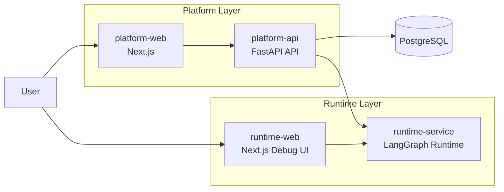

# AI Agent Test Platform

和 AI 一起开发测试平台，不只是我在这样做；如果你愿意，你也可以。

AI Agent Test Platform 是一套构建在 **LangGraph / LangChain** 之上的通用 AI 智能体平台框架，但它的后续演进会优先聚焦测试相关场景，而不是停留在一个只适合 demo 的单体示例仓库。

这套框架的核心目标，是把 **企业级平台治理能力** 和 **智能体执行能力** 明确拆开：既能支持平台侧的安全、项目管理、审计、catalog 同步与治理，也能让 agent 侧专注图编排、模型装配、tools / MCP / skills 接入和快速迭代。同时，这个仓库后续也会持续吸收 AI 智能评审、测试辅助、自动化、性能测试等测试工程方向的能力。

它不只是一个框架仓库，也是一种工作方式：把可复用的平台骨架先封装出来，再让用户拿到它以后，继续和 AI 一起协同开发、快速验证、持续提效。

## 为什么使用这套框架

如果你想要的不是“再做一个 LangGraph 演示项目”，而是基于主流框架继续向生产落地推进，这套框架的价值主要在于：

- **建立在主流生态之上**：底层仍然是 LangGraph / LangChain，学习成本和生态兼容性更好，不需要脱离主流框架重新理解一套体系。
- **优先解决生产落地问题**：平台侧已经落了自建认证、项目成员管理、审计、runtime catalog 同步、平台数据库模型与治理接口，整体部署路径围绕自托管 LangGraph 服务、自建权限体系和 PostgreSQL 组织，而不是只停留在 agent 能跑起来。
- **平台侧与 agent 侧解耦**：平台团队可以继续演进安全、项目、审计、治理和调度能力；agent 团队可以独立推进编排、模型、tools、MCP、skills 与交互体验，互相不必强耦合。
- **给二开预留空间**：平台侧当前只做了必要的基础能力与薄封装，没有把权限、业务流程、项目模型封死，便于团队在现有基础上继续扩展自己的业务平台。
- **runtime 不是薄示例，而是可复用执行层**：在 LangGraph 之上已经整理出 `create_agent`、`deepagent`、图编排、动态模型参数、动态工具池、MCP server、skills、中间件和自定义路由这些可复用能力。

## 为什么默认本地联调是四个部分

默认本地联调先聚焦四个应用，不是为了把仓库切碎，而是为了把主链路职责边界和团队协作边界拉清楚：

- **platform-api + platform-web**：负责平台控制面，关注安全、项目管理、审计、runtime 能力目录、assistant 管理和平台侧对话入口。
- **runtime-service + runtime-web**：负责 agent 执行面，关注 LangGraph 图运行、模型装配、工具 / MCP / skills 接入，以及更快的智能体开发与调试闭环。

这样的拆分有两个直接收益：

- 平台侧和 agent 侧可以 **分开开发、分开演进、分开交付**。
- 用户既可以走完整的平台链路，也可以直接进入 runtime 链路做更轻量、更高效的 agent 调试。

## 两个前端分别服务什么场景

- `apps/platform-web`：对接平台层，负责平台数据展示、平台侧聊天入口，以及项目 / 用户 / 审计 / assistant / runtime catalog 等管理能力。
- `apps/runtime-web`：直接对接 LangGraph 服务层，不经过平台 API，更适合 agent 侧快速验证、调试和前端交互迭代。

这意味着：

- 你在做 **平台产品能力** 时，重点使用 `platform-web`
- 你在做 **agent 行为验证和交互调试** 时，重点使用 `runtime-web`

## 后续计划

这个项目到现在已经持续接近一年了。

最开始的想法其实很简单，只是想把自己的开发过程记录下来，也顺便验证：在 AI 快速演进的背景下，一个测试开发工程师能不能一边学习、一边动手，把自己的理解沉淀成真正可运行的系统。

后来收到越来越多人的关注和支持，这件事也慢慢从“个人记录”变成了一条必须认真走下去的长期路线。回头看这一年，会有很多感慨：从最开始只是做一个简单的 AI 测试平台，到今天逐步把它重构成一套希望别人也能快速上手、并且具备生产落地潜力的企业级智能体平台，这中间不仅是代码的变化，更是认知和方法的持续升级。

这一年里，我也一直在补 AI 相关的知识和实践：

- AI 应用开发
- RAG
- vibe coding
- skills
- MCP
- LangGraph / LangChain 运行时能力

AI 发展得太快了，很多时候会让人产生一种“根本学不过来”的感觉。但越是在这样的阶段，越不能只是被新概念推着走。对我来说，更重要的是静下心来，认真理解这些技术为什么会出现、适合解决什么问题、怎样才能真正落到工程里；同时也要保持开放，持续拥抱变化。

项目本身也经历了明显的演进：

- 早期是以 AI 测试平台为中心的探索
- 后来逐步从 `Autogen` 迁移到 `LangGraph / LangChain`
- 再到现在，开始把平台治理、运行时执行、agent 编排与前端交互分层整理成一套更稳定的基础框架

到当前这个阶段，可以说项目的基础框架已经搭起来了：平台层、运行时层、双前端、部署文档、AI 协作型文档，这些骨架已经基本具备。但更具体的业务场景和应用层能力，我还没有全部重构完成。后面会根据时间一点一点继续补齐，把这套框架真正打磨成别人拿来就能理解、能接入、能继续二开的系统。

我自己的职业身份始终还是测试开发工程师，所以后续的能力建设，我暂时还是会坚持“不忘初衷”，优先把测试相关的能力逐步嵌入进来。不过，这个平台本身并不只服务测试 agent，它的定位一定是更通用的：任何面向业务的 agent、工作流和平台能力，都可以在这个框架里继续生长。

接下来比较明确想持续推进的方向包括：

- AI 智能评审
- AI 驱动的 UI 自动化
- 自动化脚本生成与测试辅助
- AI 性能测试
- Text-to-SQL
- 更多与测试工程、质量治理相关的智能体能力

这些内容后面会继续逐步接入到当前平台里。这个项目不会一下子变得完整，但我会持续把它往“真正可落地、可复用、可演进”的方向推进。如果你也对这些方向感兴趣，欢迎一起交流、一起见证它后面的变化。

## 项目初心

这是一个用 AI 协同开发通用智能体平台的长期实践项目。

在此之前，我已经完成过两套测试平台的开发；这一次我想做一个更有挑战的版本：在自己主导架构与关键设计的前提下，让 AI 深度参与一个可扩展、可二开的 LangGraph 智能体平台的实现、重构与演进。

它不只是一个具体业务平台仓库，也是一场关于「如何把 AI 真正带进工程开发流程」的持续实验。如果这个项目对你有帮助，欢迎 star，也欢迎交流讨论。

当前仓库文档以“怎么部署、怎么联调、怎么继续开发”为主，历史迁移过程与阶段性规划不再单独保留。

仓库当前的默认本地启动集由四个可以独立运行的应用组成：

- `apps/platform-api`：平台后端 / 控制面 API
- `apps/platform-web`：平台主前端 / 产品入口
- `apps/runtime-service`：LangGraph 执行层 / 图运行时
- `apps/runtime-web`：直连 runtime 的调试前端

此外，`apps/interaction-data-service` 作为仓库内的按需服务单独存在；它属于整体架构的一部分，但不在默认本地四服务联调集合里。

## 系统布局



这张图对应当前仓库里的两条主链路：

- **平台链路**：`platform-web -> platform-api -> runtime-service`
- **调试链路**：`runtime-web -> runtime-service`

## 仓库结构

```text
agent-platform/
├── apps/
│   ├── platform-api/
│   ├── platform-web/
│   ├── runtime-service/
│   ├── runtime-web/
│   └── interaction-data-service/
├── docs/
├── scripts/
└── archive/
```

- `apps/`：默认四服务启动集 + 按需服务目录
- `docs/`：根级公共文档
- `scripts/`：统一启动/停止/健康检查脚本
- `archive/`：归档说明与历史入口

仓库结构与职责边界以上述说明为准。

## 默认本地联调的四个应用

### `apps/platform-api`

- 平台控制面后端
- 提供：
  - `/_management/*`
  - `/api/langgraph/*`
  - 平台数据库能力
  - 鉴权、审计、catalog、assistant 管理

### `apps/platform-web`

- 平台主前端
- 面向：
  - 管理台
  - 平台侧聊天入口
  - assistant / graphs / runtime catalog 页面

### `apps/runtime-service`

- LangGraph 执行层
- 核心内容在 `graph_src_v2`
- 负责：
  - 图执行
  - 模型装配
  - 工具 / MCP 装配
  - runtime 自定义能力路由

### `apps/runtime-web`

- 直连 runtime 的调试前端
- 用于独立验证 LangGraph server 本身
- 不经过平台 API

## 仓库内的按需服务

### `apps/interaction-data-service`

- 面向结果域的数据服务
- 当前不属于默认本地四服务启动集
- 只有在用户明确提出需要接入它时，才应把它纳入本地部署任务

## 快速开始

推荐启动顺序：

1. `runtime-service`
2. `platform-api`
3. `platform-web`
4. `runtime-web`

根目录快捷脚本：

```bash
scripts/dev-up.sh
scripts/check-health.sh
scripts/dev-down.sh
```

默认本地部署与联调的唯一事实源：

- `docs/local-deployment-contract.yaml`

代理执行约束见：

- `docs/ai-deployment-assistant-instruction.md`

补充说明见：

- `docs/local-dev.md`
- `docs/env-matrix.md`

## 当前状态

当前仓库已经完成：

- 默认四服务启动集已迁入 `apps/*`
- `interaction-data-service` 作为按需服务单独保留在 `apps/*`
- 旧版根目录代码从当前工作分支移除
- `runtime-service` 可启动
- `platform-api` 可启动
- `platform-api -> runtime-service` 联调通过
- `platform-web` / `runtime-web` 已去除 Google Fonts 构建时外网依赖

当前仍保持的约定：

- 每个应用独立维护自己的环境与依赖
- 根目录暂不统一 Python/Node 依赖
- 根目录 `.pre-commit-config.yaml` 当前临时禁用，后续再统一启用

## 文档导航

- `docs/local-deployment-contract.yaml`：默认本地部署的唯一事实源
- `docs/local-dev.md`：本地开发与联调说明
- `docs/env-matrix.md`：默认四服务启动集的环境变量矩阵
- `docs/deployment-guide.md`：拉取代码后的环境准备、PostgreSQL、uv/pnpm 与补充部署说明
- `docs/ai-deployment-assistant-instruction.md`：面向 LLM 代理的 contract 使用说明与执行约束
- `docs/development-guidelines.md`：接口命名空间、数据落库与服务职责边界约定
- `docs/project-story.md`：项目初心、开发日志与演进记录

## AI 助手文档

这一组文档不是单纯给人阅读的说明书，而是给 AI 助手、开发者代理或自动化协作流程使用的仓库操作指令。默认本地部署以 `docs/local-deployment-contract.yaml` 为唯一事实源，`docs/ai-deployment-assistant-instruction.md` 只负责说明代理怎么使用这份 contract。

- `docs/local-deployment-contract.yaml`：默认本地部署 contract
- `docs/ai-deployment-assistant-instruction.md`：面向 LLM 代理的执行说明

### 让你的代理来做

如果你希望 AI 直接帮你处理当前仓库的本地环境，可以把下面这段话直接贴给它：

```text
阅读 `docs/ai-deployment-assistant-instruction.md` 帮我部署环境。
```

这句话就够了。代理应该自动继续读取 contract；如果缺少必须由你提供的材料，它应该一次性明确告诉你缺什么，而不是要求你重写一大段 prompt。

### 面向 LLM 代理

如果你在编写或调试一个代理来执行这个仓库的本地部署任务，`docs/ai-deployment-assistant-instruction.md` 应该就是单入口；代理读到它之后，应自行继续读取 `docs/local-deployment-contract.yaml`，而不是要求用户再补第二段提示词。它们应该共同解决的是：

- 当前本地部署的唯一有效口径是什么
- 配置文件应该写到哪里，哪些旧说法不能再用
- 启动、健康检查和结果汇报应该怎么做
- 模型配置缺失时应该如何收尾，而不是伪造配置

### 使用这份文档时的几个提醒

- 这套 AI 助手文档服务的是当前仓库的本地部署与验证，不是外部插件接入说明
- `platform-api` 的本地配置以 `apps/platform-api/.env` 为准
- `runtime-web` 本地最小联调应直连 `http://localhost:8123`
- 默认本地 bootstrap 账号是 `admin / admin123456`，仅适合临时本地环境

## 支持与交流

如果这个项目对你有帮助，欢迎给一个 star。

如果你希望交流测试平台、AI 协同开发、LangGraph / MCP 相关实践，欢迎通过下面的联系方式沟通。

如果你想了解这个项目的起点、阶段演进和一路上的设计取舍，可以直接看 `docs/project-story.md`。

个人微信号：


## 旧代码与历史说明

旧版 `AITestLab` 代码已不再保留在当前工作分支目录中。

如需回看旧版代码，请切换到下述仓库：

- https://github.com/ljxpython/AITestLab-archive 
