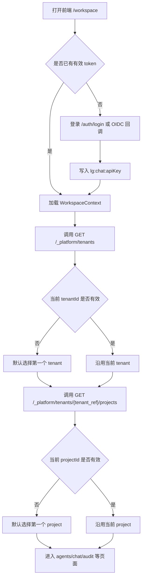
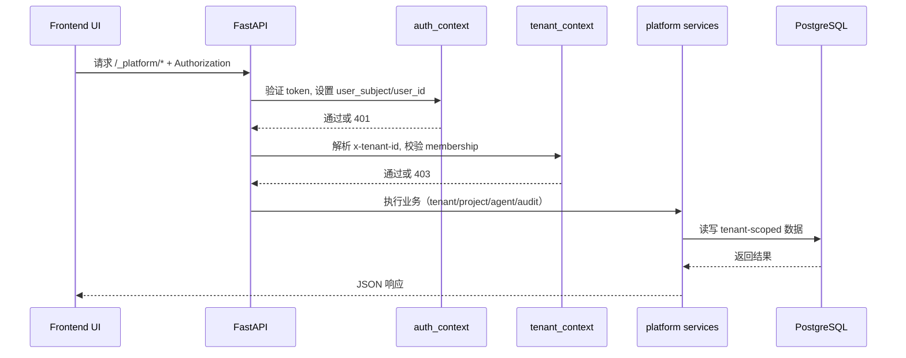
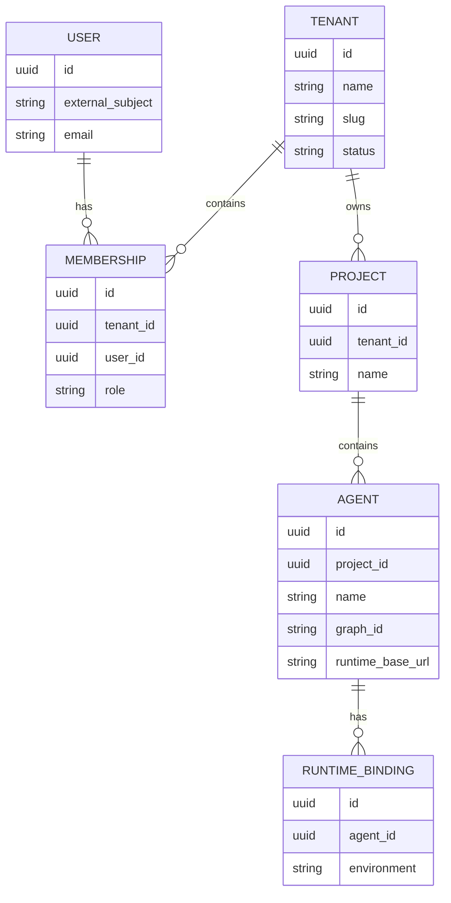

# Auth / Tenant / Project 流程与架构（Mermaid）

这份文档回答三个核心问题：

1. 前端是否是先登录再选租户？
2. 租户和项目是什么关系？
3. 请求从前端到后端是如何做鉴权与租户隔离的？

## 结论先看

- 是的，正常流程是：登录 -> 选择租户 -> 选择项目。
- 一个租户可以有多个项目。
- 一个项目只属于一个租户（不是多租户共享项目）。
- 用户与租户是多对多关系，通过 membership 绑定角色（owner/admin/member）。

## 1) 前端操作流程图

## 2) 后端鉴权与租户隔离流程图

## 3) 实体关系图（ER）

## 4) 你问的关系是否正确

- 账号（登录身份）= 你是谁。
- 租户（tenant）= 你的组织空间。
- membership（角色）= 你在该租户里的权限。
- 项目（project）是租户下资源，`project.tenant_id` 是单值外键。

因此：

- 一个租户可以有多个项目（正确）。
- 一个项目不能属于多个租户（当前架构下不支持）。

## 5) 对应代码锚点

- 前端加载租户/项目上下文：`agent-chat-ui/src/providers/WorkspaceContext.tsx`
- 后端认证中间件：`app/middleware/auth_context.py`
- 后端租户上下文与 membership 校验：`app/middleware/tenant_context.py`
- 项目服务（租户级授权）：`app/services/project_service.py`
- 数据模型（tenant_id 外键）：`app/db/models.py`
