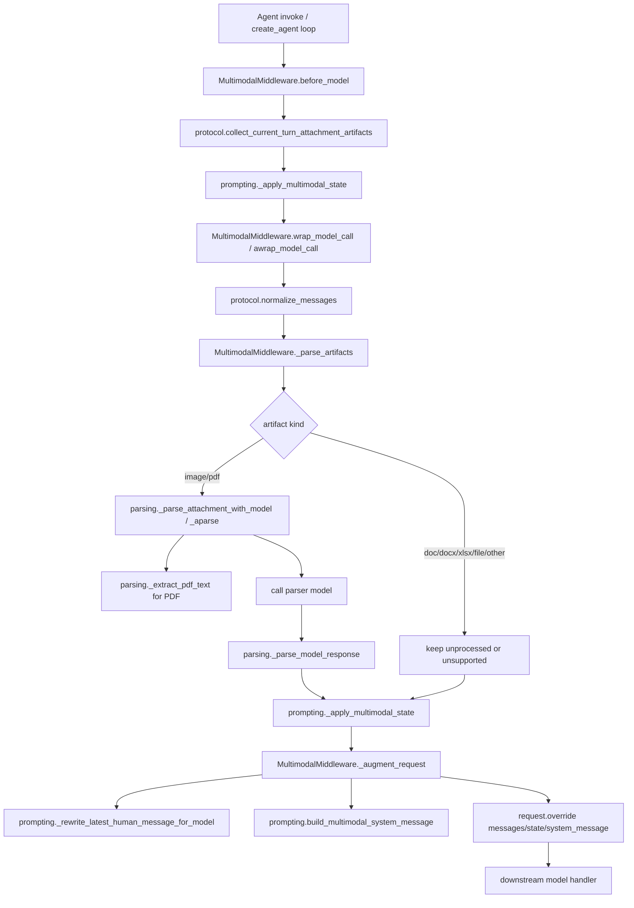

# Multimodal Middleware 代码分析与自测指南

本文面向刚接手 `runtime_service/middlewares/multimodal/` 的同学，目标是快速回答 4 个问题：

1. 这块代码分别做什么
2. 请求链路怎么走
3. 如何部署和联调
4. 如何做有效自测

## 1. 目录与职责拆解

目录：`runtime_service/middlewares/multimodal/`

- `types.py`
  - 定义状态键、artifact 结构、解析器类型。
  - 关键状态键：
    - `multimodal_attachments`
    - `multimodal_summary`
- `protocol.py`
  - 处理协议层兼容和附件识别。
  - 做两件事：
    - 把前端 block 规范化（如 `data -> base64`, `mimeType -> mime_type`）
    - 把 `image/file` block 转成统一 `AttachmentArtifact`
- `parsing.py`
  - 做附件语义解析（image/pdf）和失败兜底。
  - 包含 PDF 文本提取、调用 parser 模型、响应 JSON 解析、失败回填。
- `prompting.py`
  - 负责把解析结果转为“主模型可消费”的输入：
    - 重写最近一条 human 消息中的附件 block（替换成文本摘要）
    - 生成/清理 system message 的多模态摘要段
- `middleware.py`
  - `AgentMiddleware` 入口，串起上述模块。
  - 核心 hook：
    - `before_model`
    - `wrap_model_call`
    - `awrap_model_call`

## 2. 运行时链路（按一次请求）

### 2.1 挂载入口

`MultimodalMiddleware()` 已在多个 agent/graph 挂载，例如：

- `runtime_service/agents/assistant_agent/graph.py`
- `runtime_service/agents/deepagent_agent/graph.py`
- `runtime_service/agents/customer_support_agent/tools.py`
- `runtime_service/agents/personal_assistant_agent/tools.py`
- `runtime_service/agents/skills_sql_assistant_agent/tools.py`
- `runtime_service/services/usecase_workflow_agent/graph.py`

### 2.2 单轮调用主链路

1. 进入 `before_model(state, runtime)`
   - 基于当前 `state["messages"]` 提取“当前轮附件”
   - 写入/更新：
     - `multimodal_attachments`
     - `multimodal_summary`
2. 进入 `wrap_model_call(request, handler)`（或 async 版本）
   - `normalize_messages`：统一前端 block 形状
   - `_parse_artifacts` / `_aparse_artifacts`：
     - 仅对当前轮附件逐个处理
     - `image/pdf` 尝试语义解析
     - 其他类型保留为 `unprocessed/unsupported`
     - 失败走 fail-soft，`status=failed`
   - `_augment_request`：
     - 重写最近 human 消息里的附件 block 为摘要文本 block
     - 把 `multimodal_summary` 注入/更新到 system message
     - 把更新后的 state 挂到 request
   - 调用下游 `handler(updated_request)`，进入真实模型调用

### 2.3 主模型实际看到什么（重点）

结论先说：主模型通常看不到原始附件 block（`image/file`），而是看到中间件重写后的文本摘要。

1. human 消息如何改写
   - 只处理“最近一条带附件的 human 消息”。
   - 原来 `type=image/file` 的 block 会按顺序替换成 `type=text` 摘要块。
   - 同一条消息里的普通文本块保持原顺序，不会被删除。
   - 摘要块包含：`[附件: ...; kind=...; status=...]` + `summary_for_model` + 可选关键要点。

2. system prompt 是覆盖还是追加
   - 不是整段覆盖，默认是“在原 system prompt 基础上追加”多模态段。
   - 追加段固定头部是 `## Multimodal Attachments`，内容来自 `multimodal_summary`。
   - 如果原 system prompt 里已经有旧的 `## Multimodal Attachments` 段，会先删旧段，再追加新段，避免重复堆叠。

3. 没有摘要时如何处理
   - 当当前轮没有附件，或附件摘要为空时，会移除 `## Multimodal Attachments` 段。
   - 如果移除后原 system prompt 还有内容，保留原内容。
   - 如果移除后没有任何内容，`system_message` 变为 `None`。

4. 这套规则对应代码位置
   - 消息改写：`prompting._rewrite_latest_human_message_for_model`
   - system prompt 合并与清理：`prompting.build_multimodal_system_message`
   - 请求组装入口：`middleware._augment_request`

### 2.4 system prompt 合并示例

示例 A：原来有系统提示词，当前轮有摘要

- 输入 system prompt：
  - `You are a helpful assistant.`
- 输出 system prompt：
  - `You are a helpful assistant.`
  - 空行
  - `## Multimodal Attachments`
  - `<当前轮摘要>`

示例 B：原来有系统提示词且含旧多模态段，当前轮有新摘要

- 输入 system prompt：
  - `BASE_PROMPT`
  - 空行
  - `## Multimodal Attachments`
  - `<旧摘要>`
- 输出 system prompt：
  - `BASE_PROMPT`
  - 空行
  - `## Multimodal Attachments`
  - `<新摘要>`

示例 C：当前轮无摘要

- 输入 system prompt：
  - `BASE_PROMPT`
  - 空行
  - `## Multimodal Attachments`
  - `<旧摘要>`
- 输出 system prompt：
  - `BASE_PROMPT`

### 2.5 附件解析子链路（image/pdf）

1. 从 block 构建基础 artifact（phase1）
2. 解析分流：
   - `image`: 直接组装 vision payload 调 parser 模型
   - `pdf`:
     - 先 `base64` 解码 + `pymupdf/pymupdf4llm` 抽文本
     - 再将文本摘要任务发给 parser 模型
3. 解析响应：
   - 提取 OpenAI-compatible response 文本
   - 尝试 JSON 解析成 `summary_for_model / parsed_text / structured_data / confidence`
4. 结果合并：
   - 成功：`status=parsed`，并写 phase2 provenance
   - 失败：`status=failed`，保留错误信息；PDF 会尽量携带抽取文本/结构化上下文

## 3. 链路图



## 4. 部署与联调要点

### 4.1 依赖与环境

- Python 依赖在 `apps/runtime-service/pyproject.toml`，关键包：
  - `langchain[openai]`
  - `langgraph`
  - `langchain-openai`
  - `pymupdf4llm`
- 解析 PDF 依赖 `pymupdf + pymupdf4llm`，缺依赖时不会崩溃，会标记 failed。

### 4.2 本地服务启动

在仓库根目录执行：

```bash
cd apps/runtime-service
uv run langgraph dev --config runtime_service/langgraph.json --port 8123 --no-browser
```

建议先检查：

```bash
curl http://127.0.0.1:8123/info
curl http://127.0.0.1:8123/internal/capabilities/models
```

### 4.3 配置风险点

- parser 模型 id 默认是 `iflow_qwen3-vl-plus`（`types.py`）。
- 若 `resolve_model_by_id` 对应模型没有 `model_name/root_client/root_async_client`，解析链路会失败并打 `failed`。
- `.env` / `settings.yaml` 的模型配置不一致会导致“模型可调用但 parser 不兼容”。

## 5. 自测策略（建议按层执行）

### 5.1 单元测试（必跑）

```bash
cd apps/runtime-service
uv run pytest runtime_service/tests/test_multimodal_middleware.py -q
```

覆盖重点：

- 协议归一化：`normalize_messages`
- artifact 构建：`build_attachment_artifact`
- hook 行为：`before_model / wrap_model_call / awrap_model_call`
- block 重写：图片+PDF混合顺序
- fail-soft：parser 失败、OpenAI 响应畸形
- PDF 抽取：`_extract_pdf_text`

### 5.2 单文件脚本自测（建议先跑）

如果你想直接拿一张图片或一个 PDF 看“中间件到底做了什么”，不要绕 `pytest`，直接跑：

```bash
cd apps/runtime-service
uv run python runtime_service/tests/multimodal_selfcheck.py --file runtime_service/test_data/11a1f536fbf8a56a69ffa6b298b2408d.jpeg
uv run python runtime_service/tests/multimodal_selfcheck.py --file runtime_service/test_data/12-多轮对话中让AI保持长期记忆的8种优化方式篇.pdf
```

这个脚本会按顺序打印：

- 输入文件信息
- 前端形状 block
- `normalize_messages` 后的内容
- `_prepare_artifact_parsing` 产物
- `before_model` 写入的 state
- `wrap_model_call` 后的解析结果、重写后的消息、注入的 system prompt

如果你暂时不想打真实 parser 模型，可以加：

```bash
uv run python runtime_service/tests/multimodal_selfcheck.py --file runtime_service/test_data/12-多轮对话中让AI保持长期记忆的8种优化方式篇.pdf --prepare-only
```

### 5.3 编译检查（建议）

```bash
cd apps/runtime-service
uv run python -m compileall runtime_service
```

### 5.4 端到端联调（建议）

目标：验证“上传附件 -> 模型看到摘要 -> state 有附件产物”。

建议最小用例：

1. 发送一条含图片 block 的消息
2. 发送一条含 PDF block 的消息
3. 发送一条纯文本追问（确认旧摘要不会继续注入）

观察点：

- system prompt 中是否出现/移除 `## Multimodal Attachments`
- `multimodal_attachments` 中 status 是否符合预期（`parsed/unprocessed/failed`）
- 重写后的 human content 是否把附件 block 转成文本摘要 block
- fail-soft 下主流程是否继续返回回答

## 6. 当前实现的已知设计点（优化前先理解）

- 当前同时用到了 `before_model` 和 `wrap_model_call` 做状态处理，存在重复遍历。
- `wrap_model_call` 目前通过 `request.override(state=...)` 传状态给下游，和官方文档中 “wrap hook 通过 `ExtendedModelResponse + Command(update=...)` 回写状态” 的推荐范式有差异。
- sync/async 解析链路高度镜像（`_parse_artifacts` vs `_aparse_artifacts`, `_parse_attachment_with_model` vs `_aparse_attachment_with_model`），后续重构可考虑抽公共主干。

---

如果要做 Phase 2 优化，建议按这个顺序推进：

1. 先保证状态更新路径和 LangChain 官方范式一致
2. 再消除重复遍历与 sync/async 镜像代码
3. 最后再做性能与观测性（耗时、失败率、解析质量）增强
