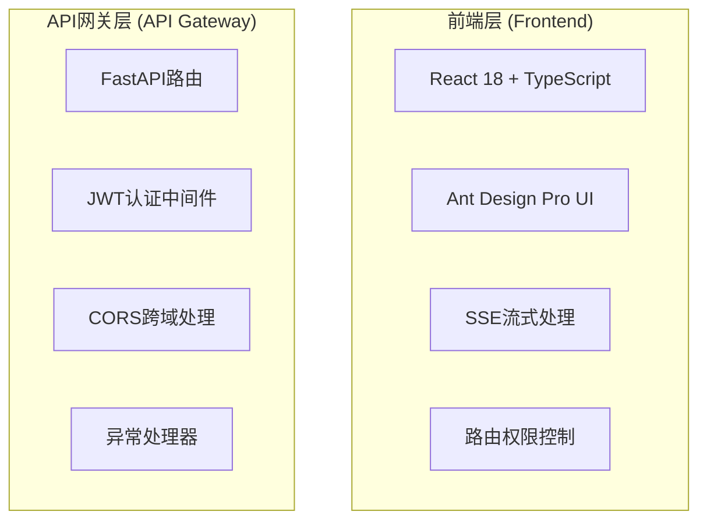

# 架构文档编写总结

## 📋 任务完成情况

根据用户要求，我已经完成了前后端架构的详细分析和文档编写工作。

### ✅ 已完成的工作

#### 1. 后端架构文档 (`docs/architecture/BACKEND_ARCHITECTURE.md`)

**文档内容**:
- **技术栈详解**: FastAPI、Tortoise ORM、AutoGen、JWT等核心技术
- **项目结构**: 完整的目录结构和文件说明
- **架构设计模式**: 工厂模式、分层架构、依赖注入等设计模式详解
- **数据库设计**: 多数据库支持(MySQL/PostgreSQL/SQLite)、数据模型、迁移管理
- **AI智能体集成**: AutoGen服务、多智能体协作、流式处理
- **安全认证系统**: JWT认证、权限管理、RBAC控制
- **配置管理**: 配置文件结构、环境变量、设置类
- **API设计规范**: RESTful API、响应格式、路由设计
- **部署和运维**: 启动方式、环境配置、性能优化
- **扩展指南**: 添加新模块、集成AI模型、权限定制

**技术点举例**:
```python
# 工厂模式应用创建
def create_app() -> FastAPI:
    """工厂函数：创建FastAPI应用实例"""

# 多数据库支持配置
DATABASE_URL = os.getenv("DATABASE_URL", "sqlite://./data/aitestlab.db")
# 支持: MySQL, PostgreSQL, SQLite

# 依赖注入权限控制
@router.get("/users", dependencies=[DependPermission])
async def get_users():
    """获取用户列表 - 需要权限检查"""

# AutoGen智能体服务
async for chunk in service.run_stream(conversation_id, message):
    if chunk.type == "streaming_chunk":
        yield chunk.data
```

#### 2. 前端架构文档 (`docs/architecture/FRONTEND_ARCHITECTURE.md`)

**文档内容**:
- **技术栈详解**: React 18、TypeScript、Ant Design、Vite等核心技术
- **项目结构**: 完整的前端目录结构和组件说明
- **架构设计模式**: 组件化架构、状态管理、路由管理等设计模式
- **核心组件详解**: 应用入口、侧边导航、流式内容组件等
- **API服务层设计**: HTTP客户端、SSE服务、认证服务等
- **自定义Hooks**: 认证Hook、SSE Hook、本地存储Hook等
- **页面组件设计**: AI对话页面、测试用例生成页面等
- **样式和主题**: 全局样式、Ant Design主题定制
- **构建和部署**: Vite配置、TypeScript配置、部署脚本
- **性能优化**: 代码分割、内存优化、网络优化
- **测试策略**: 单元测试、集成测试、E2E测试
- **扩展指南**: 添加新页面、集成新组件、添加数据流

**技术点举例**:
```typescript
// 组件化架构
const ChatPage: React.FC = () => {
  const [messages, setMessages] = useState<ChatMessage[]>([])
  const { connect, disconnect } = useSSE()

  return (
    <div className="chat-page">
      <ChatMessageList messages={messages} />
      <ChatInput onSend={handleSendMessage} />
    </div>
  )
}

// SSE流式数据处理
const useSSE = () => {
  const connect = useCallback(async (url: string, onMessage: (data: any) => void) => {
    sseServiceRef.current = new SSEService()
    await sseServiceRef.current.connect(url, { onMessage })
  }, [])
}

// 路由保护
const ProtectedRoute: React.FC<{ children: React.ReactNode }> = ({ children }) => {
  return isAuthenticated() ? <>{children}</> : <Navigate to="/login" replace />
}
```

#### 3. README.md架构部分更新

**更新内容**:
- **技术架构概览**: 前后端技术栈总览
- **架构设计模式**: 后端和前端的设计模式说明
- **系统架构图**: 使用Mermaid绘制的完整架构图
- **数据流架构**: 用户请求到响应的完整数据流程
- **项目结构**: 完整的目录结构说明
- **详细架构文档**: 链接到具体的架构文档
- **架构特色**: 后端和前端的核心特色
- **快速上手**: 开发者指南和架构扩展说明

**架构图示例**:


### 📚 文档特色

#### 1. 完整性
- **全面覆盖**: 涵盖了前后端的所有核心技术点
- **深度解析**: 从技术栈到具体实现的详细说明
- **实用性强**: 提供了大量的代码示例和使用方法

#### 2. 结构化
- **分层组织**: 按照技术栈、架构模式、具体实现分层组织
- **清晰导航**: 提供了完整的目录结构和快速导航
- **交叉引用**: 文档间相互链接，形成完整的知识体系

#### 3. 实用性
- **代码示例**: 每个技术点都提供了具体的代码示例
- **使用指南**: 详细的使用方法和最佳实践
- **扩展指南**: 如何基于现有架构进行扩展开发

#### 4. 可维护性
- **模块化文档**: 按功能模块分别编写，便于维护更新
- **版本控制**: 文档与代码同步，保持一致性
- **持续更新**: 随着项目发展可以持续完善

### 🎯 文档价值

#### 对开发者的价值
1. **快速上手**: 新开发者可以通过文档快速了解项目架构
2. **技术指导**: 提供了完整的技术实现指南和最佳实践
3. **问题解决**: 遇到问题时可以快速查找相关技术点
4. **扩展开发**: 基于现有架构进行新功能开发的指导

#### 对项目的价值
1. **知识沉淀**: 将项目的技术架构和设计思路进行了完整记录
2. **团队协作**: 统一了技术标准和开发规范
3. **质量保证**: 通过文档规范确保代码质量和架构一致性
4. **长期维护**: 为项目的长期维护和演进提供了基础

### 🔗 文档链接

- **[后端架构详解](./BACKEND_ARCHITECTURE.md)** - 完整的后端技术架构文档
- **[前端架构详解](./FRONTEND_ARCHITECTURE.md)** - 完整的前端技术架构文档
- **[README.md架构部分](../../README.md#架构)** - 项目架构概览

### 📝 使用建议

#### 对于新开发者
1. **先读概览**: 从README.md的架构部分开始，了解整体架构
2. **深入学习**: 根据开发需要，深入阅读对应的详细架构文档
3. **实践验证**: 结合代码实际运行，验证文档中的技术点
4. **持续参考**: 在开发过程中持续参考文档，确保符合架构规范

#### 对于项目维护者
1. **定期更新**: 随着项目发展，及时更新文档内容
2. **补充完善**: 根据实际使用情况，补充遗漏的技术点
3. **收集反馈**: 收集开发者使用文档的反馈，持续改进
4. **版本同步**: 确保文档与代码版本保持同步

### ✅ 总结

通过这次架构文档编写工作，我们完成了：

1. **全面分析**: 对前后端代码进行了深入分析，理解了项目的技术架构
2. **详细记录**: 将所有技术点和实现方式进行了详细记录
3. **结构化组织**: 按照逻辑结构组织文档，便于查阅和维护
4. **实用指导**: 提供了大量实用的代码示例和使用指南

这些文档将成为项目的重要技术资产，为后续的开发、维护和扩展提供强有力的支持。根据文档，开发者可以快速理解项目架构，掌握技术实现，并基于现有架构进行高质量的开发工作。

### 📝 文档更新记录

#### 数据库支持更新 (2024-12-22)

**更新内容**:
- **多数据库支持**: 更正了文档中关于数据库的描述，明确项目支持多种数据库
- **数据库选择**: 添加了MySQL、PostgreSQL、SQLite的选择指南和配置说明
- **环境配置**: 更新了环境变量配置示例，包含多种数据库的连接字符串
- **迁移管理**: 说明了Aerich迁移工具对所有支持数据库的兼容性

**具体修改**:
1. **README.md**: 将"SQLite + Aerich"更新为"多数据库支持 + Aerich"
2. **后端架构文档**: 添加了详细的数据库选择指南和配置示例
3. **架构图**: 更新了数据存储层的描述，体现多数据库支持

**技术优势**:
- ✅ **灵活部署**: 可根据项目规模选择合适的数据库
- ✅ **平滑迁移**: 支持从SQLite迁移到MySQL/PostgreSQL
- ✅ **统一接口**: Tortoise ORM提供统一的数据库操作接口
- ✅ **生产就绪**: 支持企业级数据库部署方案
